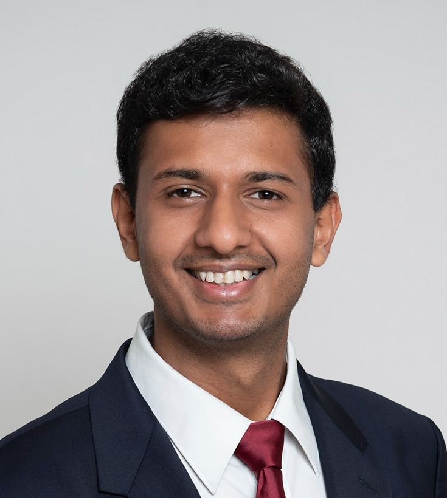

$~~~~~$ 

Hi there! I am Ayush Garg. I'm a 2021 ETH Zürich Master's graduate in Robotics, Systems and Controls, where I mostly studied Machine Learning/Deep Learning, and the rigorous mathematics behind the popular and state-of-the-art ML algorithms. After spending two years as an ML Researcher at [IBM Research Zurich](https://www.zurich.ibm.com/), I decided to back to my home in New Delhi, India, to be with my family.

I am currently looking for exciting job opportunities in AI/ML Research and Engineering, while also working on some cool projects of my own (will share the details in a blog post soon). Please feel free to reach out to me for correspondence of any and all kinds :)

